# Data model

<!-- AUTO-GENERATED by backend/scripts/generate_erd.py — do not edit.
     Regenerate after any model change (from backend/):
     python scripts/generate_erd.py -->

One box per database table — the things the app remembers. Reading the
diagram:

- `PK` primary key, `FK` foreign key, `UK` unique.
- An edge means "the row on the many side points at the row on the one
  side". The label shows the linking column and **what happens to the
  pointing row when the row it points at is deleted**: CASCADE = deleted
  too; SET NULL = kept, but unlinked.
- `||` exactly one · `|o` zero or one (the link is optional).

```mermaid
erDiagram
    breakdown_audio {
        uuid passage_id PK,FK
        string language PK,FK
        string voice PK
        string media_type
        bytes data
        json timings "nullable"
        datetime created_at
    }
    conversations {
        uuid id PK
        uuid user_id FK "nullable"
        string title "nullable"
        bool share_journal
        datetime created_at
    }
    daily_passages {
        uuid id PK
        date date UK
        uuid passage_id FK
        datetime created_at
    }
    journal_entries {
        uuid id PK
        uuid user_id FK
        uuid passage_id FK "nullable"
        date date
        text content
        text reflection "nullable"
        string reflection_model "nullable"
        datetime created_at
        datetime updated_at
    }
    llm_usage {
        uuid id PK
        uuid user_id FK "nullable"
        string kind
        string model
        int input_tokens
        int output_tokens
        int cache_creation_input_tokens
        int cache_read_input_tokens
        datetime created_at
    }
    messages {
        uuid id PK
        uuid conversation_id FK
        string role
        text content
        datetime created_at
    }
    notes {
        uuid id PK
        uuid user_id FK
        uuid passage_id FK "nullable"
        date date
        text content
        datetime created_at
        datetime updated_at
    }
    oauth_accounts {
        uuid id PK
        uuid user_id FK
        string oauth_name
        string access_token
        int expires_at "nullable"
        string refresh_token "nullable"
        string account_id
        string account_email
    }
    passage_audio {
        uuid passage_id PK,FK
        string voice PK
        string media_type
        bytes data
        json timings "nullable"
        datetime created_at
    }
    passage_breakdowns {
        uuid passage_id PK,FK
        string language PK
        text text
        string model
        datetime created_at
    }
    passage_reads {
        uuid id PK
        uuid user_id FK
        uuid passage_id FK
        date date
        datetime created_at
    }
    passages {
        uuid id PK
        string author
        string work
        string reference UK
        int position
        string translator
        text text
        bool curated
        vector embedding "nullable"
        text original_text "nullable"
        string original_language "nullable"
        string original_source "nullable"
        datetime created_at
    }
    practice_intentions {
        uuid id PK
        uuid user_id FK,UK
        int minutes_per_day
        time time_of_day "nullable"
        datetime created_at
        datetime updated_at
    }
    practice_sessions {
        uuid id PK
        uuid user_id FK
        date date
        string guide "nullable"
        datetime started_at
        datetime ended_at "nullable"
        int duration_seconds "nullable"
        array steps_completed
    }
    users {
        uuid id PK
        string email UK
        string hashed_password
        bool is_active
        bool is_superuser
        bool is_verified
        string tier
        string stripe_customer_id UK "nullable"
        datetime plus_renews_at "nullable"
        bool plus_cancel_at_period_end
    }
    passage_breakdowns ||--o{ breakdown_audio : "passage_id · CASCADE"
    passage_breakdowns ||--o{ breakdown_audio : "language · CASCADE"
    users |o--o{ conversations : "user_id · SET NULL"
    passages ||--o{ daily_passages : "passage_id · CASCADE"
    users ||--o{ journal_entries : "user_id · CASCADE"
    passages |o--o{ journal_entries : "passage_id · SET NULL"
    users |o--o{ llm_usage : "user_id · SET NULL"
    conversations ||--o{ messages : "conversation_id · CASCADE"
    users ||--o{ notes : "user_id · CASCADE"
    passages |o--o{ notes : "passage_id · SET NULL"
    users ||--o{ oauth_accounts : "user_id · CASCADE"
    passages ||--o{ passage_audio : "passage_id · CASCADE"
    passages ||--o{ passage_breakdowns : "passage_id · CASCADE"
    users ||--o{ passage_reads : "user_id · CASCADE"
    passages ||--o{ passage_reads : "passage_id · CASCADE"
    users ||--o{ practice_intentions : "user_id · CASCADE"
    users ||--o{ practice_sessions : "user_id · CASCADE"
```

